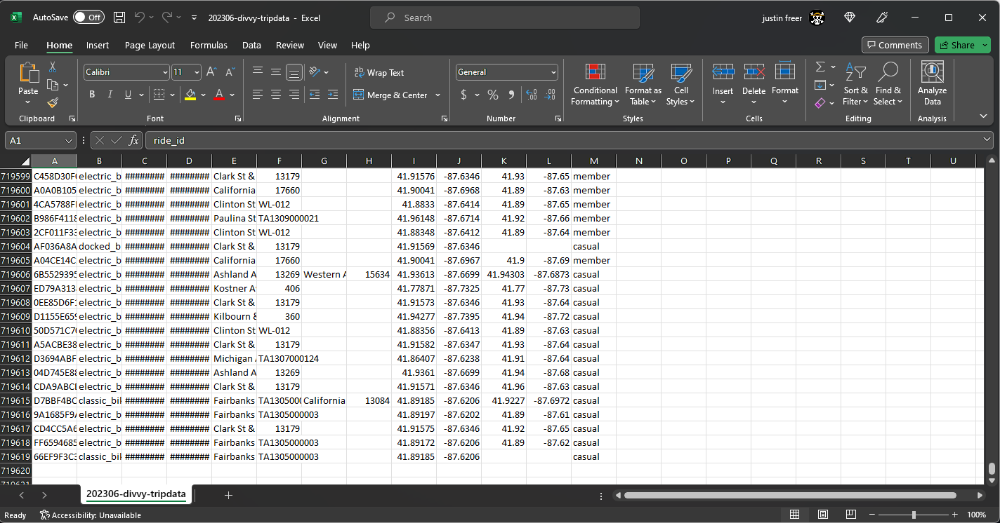

# Cyclistic  

## How to navigate speedy success of a fictional bike-share company?  

Welcome,

As I approach the finish of my Google Data Analytics Certificate bootcamp on Coursera, It is my pleasure to present to you my final capstone project. In this case study, I will reveal the analysis of a public dataset for a fictional company provided as part of this course. For my analysis, I will utilize Excel spreadsheets for data processing and visualizations.

### *Who* is Cyclistic?

#### Company overview:

In 2016, Cyclistic launched an impressive bike-sharing program that swiftly gained popularity. It now operates 5,824 GPS-equipped bikes from 692 Chicago stations. These bikes can be unlocked from one station and returned to any other station within the system, offering users flexibility and convenience. Cyclistic's strategy emphasizes broad consumer reach. Their diverse pricing includes single-ride, full-day passes, and annual memberships. Casual riders choose passes, while subscribers become Cyclistic members.

Cyclistic sets itself apart by also offering reclining bikes, hand tricycles, and cargo bikes, making bike-share more inclusive to people with
disabilities and riders who can’t use a standard two-wheeled bike. The majority of riders opt for traditional bikes; about
8% of riders use the assistive options. Cyclistic users are more likely to ride for leisure, but about 30% use them to
commute to work each day.

## Scenario

I am a junior data analyst working in the marketing analyst team at Cyclistic, a bike-share company in Chicago. The director
of marketing believes the company’s future success depends on maximizing the number of annual memberships. Therefore,
my team wants to understand how casual riders and annual members use Cyclistic bikes differently. From these insights,
my team will design a new marketing strategy to convert casual riders into annual members. But first, Cyclistic executives
must approve my recommendations, so they must be backed up with compelling data insights and professional data
visualizations.

#### <ins>Characters and team:

* **Lily Moreno:** The director of marketing and my manager. Moreno is responsible for the development of campaigns
and initiatives to promote the bike-share program. These may include email, social media, and other channels.

* **Cyclistic marketing analytics team:** A team of data analysts who are responsible for collecting, analyzing, and
reporting data that helps guide Cyclistic marketing strategy. I joined this team six months ago and have been busy
learning about Cyclistic’s mission and business goals — as well as how I, as a junior data analyst, can help Cyclistic
achieve them.

* **Cyclistic executive team:** The notoriously detail-oriented executive team will decide whether to approve the
recommended marketing program.

#### <ins>Main goal:

Moreno has set a clear goal: Design marketing strategies aimed at converting casual riders into annual members. In order to
do that, however, the marketing analyst team needs to better understand how annual members and casual riders differ, why
casual riders would buy a membership, and how digital media could affect their marketing tactics. Moreno and her team are
interested in analyzing the Cyclistic historical bike trip data to identify trends.

To approach this case study, I will adhere to the following data analysis steps: **Ask, Prepare, Process, Analyze, Share, and Act.**

# Ask

Three questions will guide the future marketing program:
1. How do annual members and casual riders use Cyclistic bikes differently?
2. Why would casual riders buy Cyclistic annual memberships?
3. How can Cyclistic use digital media to influence casual riders to become members?

Moreno has assigned me the first question to answer: **How do annual members and casual riders use Cyclistic bikes
differently?**

# Prepare

For my project, I will be utilizing the [public dataset](https://divvy-tripdata.s3.amazonaws.com/index.html) which is made accessible by Motivate International Inc. under a specific [license](https://ride.divvybikes.com/data-license-agreement). I have downloaded the data for the period between July 2022 and June 2023. 

The data is in CSV (comma-separated values) format and comprises a total of 13 columns. 

[(Raw tripdata screenshot 2023/06)](https://github.com/JusFre/JusFre.github.io/blob/main/202306_raw_tripdata.png)

Then, I converted all CSV files to Excel format. 
Now all files have been conveniently stored and organized.

[(Excel formatted files)](https://github.com/JusFre/JusFre.github.io/blob/main/Excel%20formatted%20files.png)

#### <ins>The dataset meets ROCCC criteria, as detailed below
* Reliable: Yes, it is unbiased.
* Original: Yes, we can locate the original public data.
* Comprehensive: Yes, it contains all relevant information.
* Current: Yes, it is updated monthly.
* Cited: Yes, the data is properly referenced.

# Process

