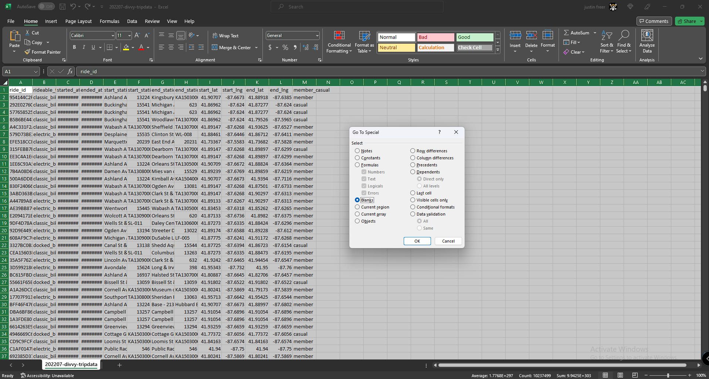

# Cyclistic

## How to navigate speedy success of a fictional bike-share company?

Welcome,

As I approach the finish of my Google Data Analytics Certificate bootcamp on Coursera, It is my pleasure to present to you my final capstone project. In this case study, I will reveal the analysis of a public dataset for a fictional company provided as part of this course. For my analysis, I will utilize Excel spreadsheets for data processing and visualizations.

### *Who* is Cyclistic?

#### Company overview:

In 2016, Cyclistic launched an impressive bike-sharing program that swiftly gained popularity. It now operates 5,824 GPS-equipped bikes from 692 Chicago stations. These bikes can be unlocked from one station and returned to any other station within the system, offering users flexibility and convenience. Cyclistic's strategy emphasizes broad consumer reach. Their diverse pricing includes single-ride, full-day passes, and annual memberships. Casual riders choose passes, while subscribers become Cyclistic members.

Cyclistic sets itself apart by also offering reclining bikes, hand tricycles, and cargo bikes, making bike-share more inclusive to people with
disabilities and riders who can’t use a standard two-wheeled bike. The majority of riders opt for traditional bikes; about
8% of riders use the assistive options. Cyclistic users are more likely to ride for leisure, but about 30% use them to
commute to work each day.

## Scenario

I am a junior data analyst working in the marketing analyst team at Cyclistic, a bike-share company in Chicago. The director
of marketing believes the company’s future success depends on maximizing the number of annual memberships. Therefore,
my team wants to understand how casual riders and annual members use Cyclistic bikes differently. From these insights,
my team will design a new marketing strategy to convert casual riders into annual members. But first, Cyclistic executives
must approve my recommendations, so they must be backed up with compelling data insights and professional data
visualizations.

### Characters and team:

* **Lily Moreno:** The director of marketing and my manager. Moreno is responsible for the development of campaigns
and initiatives to promote the bike-share program. These may include email, social media, and other channels.

* **Cyclistic marketing analytics team:** A team of data analysts who are responsible for collecting, analyzing, and
reporting data that helps guide Cyclistic marketing strategy. I joined this team six months ago and have been busy
learning about Cyclistic’s mission and business goals — as well as how I, as a junior data analyst, can help Cyclistic
achieve them.

* **Cyclistic executive team:** The notoriously detail-oriented executive team will decide whether to approve the
recommended marketing program.

### Main goal:

Moreno has set a clear goal: Design marketing strategies aimed at converting casual riders into annual members. In order to
do that, however, the marketing analyst team needs to better understand how annual members and casual riders differ, why
casual riders would buy a membership, and how digital media could affect their marketing tactics. Moreno and her team are
interested in analyzing the Cyclistic historical bike trip data to identify trends.

To approach this case study, I will adhere to the following data analysis steps: **Ask, Prepare, Process, Analyze, Share, and Act.**

# Ask

Three questions will guide the future marketing program:
1. How do annual members and casual riders use Cyclistic bikes differently?
2. Why would casual riders buy Cyclistic annual memberships?
3. How can Cyclistic use digital media to influence casual riders to become members?

Moreno has assigned me the first question to answer: **How do annual members and casual riders use Cyclistic bikes
differently?**

# Prepare

For my project, I will be utilizing the [public dataset](https://divvy-tripdata.s3.amazonaws.com/index.html) which is made accessible by Motivate International Inc. under a specific [license](https://ride.divvybikes.com/data-license-agreement). I have downloaded the data for the period between July 2022 and June 2023. 

The data is in CSV (comma-separated values) format and comprises a total of 13 columns. 

[202306_raw_tripdata.png](https://github.com/JusFre/JusFre.github.io/blob/main/202306_raw_tripdata.png)

Then, I converted all CSV files to Excel format. 
Now all files have been conveniently stored and organized.

[excel_formatted_files.png](https://github.com/JusFre/JusFre.github.io/blob/main/Excel%20formatted%20files.png)

#### The dataset meets ROCCC criteria, as detailed below:
* Reliable: Yes, it is unbiased.
* Original: Yes, we can locate the original public data.
* Comprehensive: Yes, it contains all relevant information.
* Current: Yes, it is updated monthly.
* Cited: Yes, the data is properly referenced.

# Process

 
For my project I will be using Excel Workbooks to clean and process each of the 12 files and to achieve stakeholder deliverables. XLSX files can store more data and have a better compression algorithm, saving you space.

### Cleaning the data

If the sheets have any missing data, remove the entire row.

[cleaning_tripdata_emptycells.png](Emptycell_tripdata_cleaning.png)

First select all data: Cntrl + A -> Cntrl + G -> Special.. -> Blank -> OK.

### Add new columns by using formulas

Create "ride_length" and "day_of_week" columns.

[New_columns_tridata.png](New_columns_tridata.png)

I entered the formulas "=D2-C2" in cell N2 and "=WEEKDAY(C2,1)" in cell O2. Copied and pasted the formulas down the rest of the dataset. Also changed the cell format for time to "37:30:55" for column N.

Some months might have faulty "ride_length" data filled with #######. As an analyst doing our process step, I sorted and deleted these rows.

[remove_null_tripdata.png](remove_null_tripdata.png)

I sorted the "ride_length" data from smallest to largest and found null values, then selected the rows to be deleted.

### Combine all 12 files into one megafile

We are going to merge the 11 other sheets into the first sheet by creating new tabs at the bottom by using Power Query (Google search) or simply copying and pasting each sheet with CTRL+A -> CTRL+C -> then pasting into a new tab in the first sheet with CTRL+V.

I will now have 12 tabs when finished with no blank cells, new columns added, and deleted null data. 

[megafile_tripdata_merge.png](megafile_tripdata_merge.png)

I have cleaned and aggregated the data . Combined the 12 files into 1 megafile and created new columns.

A large portion of the 12 sheets, summing over 1+ GB of data, were purged from our files.

# Analyze

Key tasks:
- Aggregate the data to make it useful and accessible.
- Organize and format the data.
- Perform calculations.
- Identify trends and relationships.

I used pivot tables to sort, filter, and condense only the most essential data, then created graphs and pivot tables to achieve stakeholder deliverables. 

[summary_tripdata_visual.png](summary_tripdata_visual.png)

First I ran a few calculations in two tabs of opposite seasons to get a better sense of the data layout.

Using "=AVERAGE(N:N)", "=MAX(N:N)", and "=MODE(O:O)" I calculated the "Mean of ride length", "Max of ride length", and "Mode for day of week".
Once in the winter of 12-2022 and again in the summer of 06-2023. 

#### Next I inserted pivot tables and inserted recommended charts to:
* Calculate the average ride_length for members and casual riders
* Calculate the average ride_length for users by day_of_week
* Calculate the number of rides for users by day_of_week

I then took my two seasonal analysis sheets and merge the pivot tables and graphs into one new sheet. 

## What have we found to answer the question: **How do annual members and casual riders use Cyclistic bikes differently?**

In the winter of December 2022, the number of users trended higher numbers of "members" during the weekdays while "casual" riders were generally much less active through the week.

[tripdata_winter_day_of_week.png](tripdata_winter_day_of_week.png)

In the summer of June 2023, the number of users trended substantially higher numbers of "members" with a relative curve of riders during the weekdays.

### The "casual" riders had a very insightful *boom* of riders during the summer weekends:

[tripdata_summer_day_of_week.png](tripdata_summer_day_of_week.png)

# Share

Now we have an Excel summary to present our finding and answer the question of how annual members and casual riders use Cyclistic bikes differently.

[summary_tripdata_visual.png](summary_tripdata_visual.png)

From the analysis above, we can conclude that "casual" riders predominantly use the bike-sharing service on weekends in the summer season, while "members" use it throughout the week with a slight increase on weekdays.

# Act

### My three top recommendations based on this analysis:

* Raise the rental fees for weekend casual rides as a way to encourage a shift towards membership conversion.

* Provide special price reductions and attractive bonuses to "casual" riders who transition into membership during weekends and summer periods.

* Implement a time-constrained promotion for annual memberships that loosens ride limits on Fridays, Saturdays, and Sundays, recognizing the appeal of these days to "casual" cyclists.

## I want to express my gratitude for your effort in reviewing the analysis. Your valuable feedback means a lot to me, and I'm looking forward to any comments or suggestions you might have.

